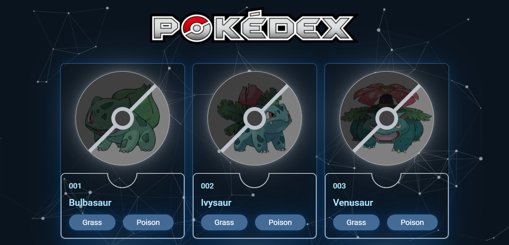
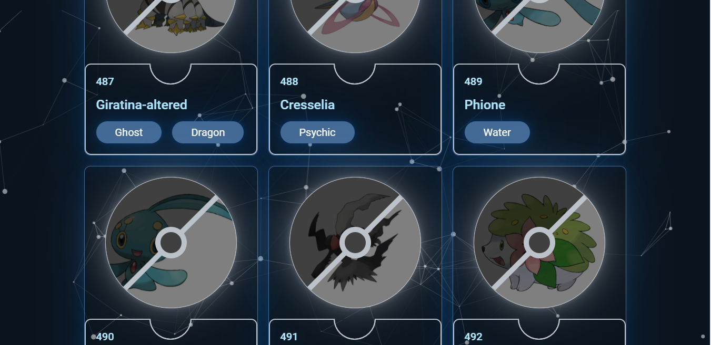

# Pokedex using API
## Deploy
> https://nostalgic-hugle-99ebc6.netlify.app/

## Endpoint
- Get Name, Type of Pokemon
>https://pokeapi.co/api/v2/pokemon/

## Image Data
- Get Image of Pokemon by its Name
>https://img.pokemondb.net/artwork/large/${data.name}.jpg

## Javascript Library
> particles.js

## Demo

